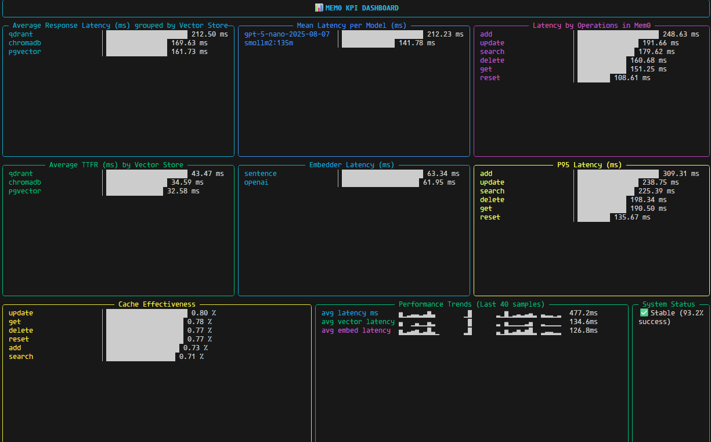

# 🧠 Mem0 Analytics

> **Telemetry and performance intelligence for memory-driven AI systems.**
> One install — full visibility into how your Mem0 stack performs.

[](https://pypi.org/project/mem0-analytics/)
[](https://www.python.org/)
[](https://sqlite.org/)
[](https://posthog.com/)
[](LICENSE)

---

## 🧩 What It Is

**Mem0 Analytics** is the **built-in monitoring and observability layer** for the [Mem0](https://github.com/mem0ai/mem0) framework.
It measures, aggregates, and visualizes the complete lifecycle of memory interactions — from LLM calls to vector operations — with **no manual setup or instrumentation required**.

Once installed, it automatically:

* Captures latency, token usage, cache efficiency, and system metrics
* Aggregates performance data every 60 seconds
* Displays results through a **real-time terminal dashboard**
* Optionally syncs to **PostHog** for team dashboards

---

## ⚡ Quick Start

Install directly from PyPI:

```bash
pip install mem0-analytics
```

Then just use Mem0 as usual — analytics activates automatically.

To open the **live dashboard**, run:

```bash
mem0-dashboard
```

Metrics are stored locally at:

```
~/.mem0_metrics.db
```

🛢️ To see the db, open the SQLite shell
```bash
sqlite3 ~/.mem0_metrics.db
```


📊 List all tables
```bash
.tables
```

You should see something like:
```bash
mem0_met      mem0_kpi
```

View the schema of a specific table
```bash
.schema mem0_kpi
```

or for the raw metrics:
```bash
.schema mem0_met
```

Preview table contents
```bash
SELECT * FROM mem0_kpi LIMIT 10;
```

See table info (columns and types)
```bash
PRAGMA table_info(mem0_kpi);
```

---

## 📊 What It Tracks

| Category         | Metrics                                     | Description                            |
| ---------------- | ------------------------------------------- | -------------------------------------- |
| **Performance**  | `avg_latency_ms`, `latency_p95`, `ttfr_ms`  | Average, tail, and cold-start latency  |
| **Embeddings**   | `avg_embed_latency`                         | Mean embedding generation time         |
| **Vector Store** | `avg_vector_latency`, `cache_effectiveness` | Query efficiency and cache utilization |
| **System**       | `cpu_percent`, `mem_used_mb`                | Process-level system footprint         |
| **Reliability**  | `success_rate`, `error_rate`                | Operation health and stability         |

---

## 🖥 Local Dashboard



A high-frequency dashboard rendered with [`rich`](https://github.com/Textualize/rich), showing:

* Latency (mean and P95) by function
* Embedder and vector database performance
* Cache efficiency and request success rate
* Time-to-First-Response (TTFR)
* Live stability and health indicators

No external services. Runs fully offline.

---

## ☁️ Cloud Integration (Optional)

For centralized analytics or multi-agent visibility:

```bash
export POSTHOG_API_KEY=<your_key>
export POSTHOG_HOST=https://app.posthog.com
```

The local aggregator automatically batches KPIs and publishes them to PostHog every 60 seconds.

---

## 🧱 Architecture

```
Mem0 (LLM, Vector Store, Embedder)
   │
   ├── analytics.py  → auto-captures runtime metrics
   │
   ├── ~/.mem0_metrics.db  → local SQLite telemetry store
   │
   ├── dashboard.py  → live Rich terminal visualization
   │
   └── (optional) PostHog sync → team dashboards
```

**Local-first by default** — privacy-safe, transparent, and extensible.

---

## 🔧 Supported Ecosystem

Mem0 Analytics automatically works across all Mem0 integrations:

| Layer             | Supported Backends                                                                                    |
| ----------------- | ----------------------------------------------------------------------------------------------------- |
| **LLMs**          | OpenAI (`gpt-5-nano`, `gpt-4o-mini`), Ollama (`smollm2`), Claude, Gemini, LLaMA, DeepSeek, Groq, etc. |
| **Vector Stores** | Qdrant, ChromaDB, Weaviate, FAISS, Pinecone, Milvus, Redis, LanceDB                                   |
| **Embedders**     | OpenAI, Ollama, Hugging Face, Instructor, BGE, Sentence Transformers                                  |

No adapters, no config. If it runs on Mem0 — it’s tracked.

---

## 🧠 Why It Exists

Monitoring LLM pipelines shouldn’t need Grafana, SQL schemas, or complex telemetry setups.
**Mem0 Analytics** makes performance **transparent** — giving developers instant insight into how memory operations behave, degrade, and optimize over time.

---

## 🔬 Highlights

* ⚙️ Zero-config integration with Mem0
* 🪶 Lightweight — <1 ms overhead per call
* 📦 SQLite for local metrics
* 📊 Real-time Rich dashboard
* ☁️ PostHog cloud mode for teams
* 🔁 Rolling aggregation of KPIs every minute
* 🧩 Pluggable design — supports any backend

---

## 🧭 Roadmap

* [x] Local SQLite metrics engine
* [x] Live terminal dashboard
* [x] PostHog sync
* [x] Token & cost analysis
* [x] Anomaly alerts (p95, cache, TTFR)
* [ ] Prometheus exporter
* [ ] Multi-agent benchmarking

---

## 🤝 Contributing

Pull requests are open.
Extend metric types, add providers, or improve visualizations.

---

## 📜 License

Licensed under the **MIT License**.
See [`LICENSE`](./LICENSE) for details.
